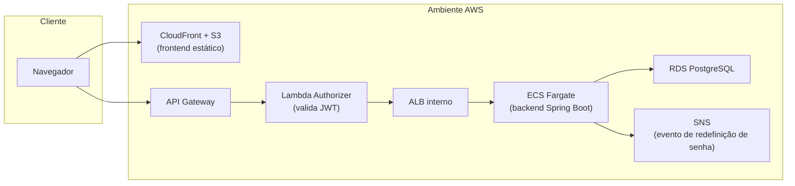

# Arquitetura

O sistema roda em dois ambientes possíveis, com o mesmo backend Spring
Boot + frontend Next.js:

- **[AWS](infra-aws.md)** — ambiente de nuvem (dev/prod), pensado para
  produção.
- **[Raspberry Pi](infra-raspberry-pi.md)** — ambiente local/on-premises,
  rodando via Docker Compose numa rede local (casa/loja), sem depender de
  internet ou custo de nuvem.

## Visão geral de componentes

Este é o desenho do ambiente AWS; o ambiente Raspberry Pi substitui todo o
lado direito por três containers Docker na mesma rede local (banco,
backend e frontend) — ver [infra-raspberry-pi.md](infra-raspberry-pi.md).

Este site descreve a arquitetura em **alto nível** (componentes e como se
conectam), sem detalhar módulos Terraform, scripts individuais ou dados
sensíveis (nomes de recursos, políticas IAM, IPs) — para esse nível de
detalhe, consultar diretamente `sistemas/infra-aws/` e
`sistemas/infra-rasp/` no repositório do sistema.
