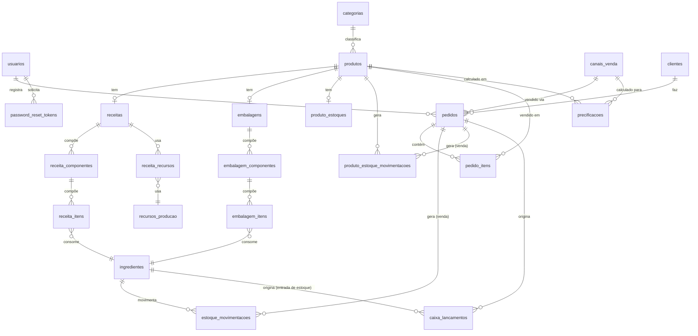

# Diagrama de relacionamento

Redesenhado a partir das migrations Flyway atuais (`V1`–`V14`) — a imagem
`Diagrama_Relacionamento_Banco.png` original estava desatualizada (não
refletia, por exemplo, a estrutura de embalagem por múltiplos componentes
introduzida na `V11`, nem `canais_venda`/`recursos_producao`) e não foi
reaproveitada.

## Notas de leitura

- `produtos` → `receitas` e `produtos` → `embalagens` são relações
  1:0..1 opcionais: um produto pode existir sem ficha técnica e/ou sem
  embalagem cadastrada.
- `embalagem_itens` e `receita_itens` referenciam a mesma tabela
  `ingredientes` — o campo `tipo` (`INGREDIENTE`/`EMBALAGEM`) em
  `ingredientes` é o que determina qual uso é válido em cada contexto
  (validado na aplicação, não por constraint de banco).
- `caixa_lancamentos.origem` determina se o lançamento veio de
  `pedido_id` (venda) ou `ingrediente_id` (entrada de estoque) — os dois
  campos são mutuamente exclusivos na prática, mas ambos nullable no
  schema.
- `metas` não tem relacionamento de FK com nenhuma outra tabela — é
  consultada por `mes_referencia` (string `yyyy-MM`) a partir do
  dashboard.

Para os campos e tipos completos de cada tabela, ver
[Modelo de dados](modelo-de-dados.md).
